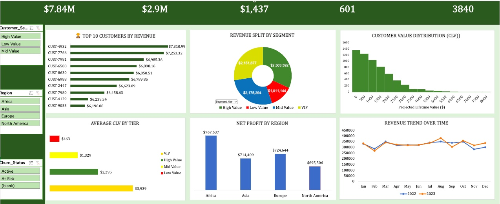

Customer Lifetime Value (CLV) & E-commerce Profitability Analysis (Excel)

📌 Project Overview
This project delivers a full-scale business analytics solution built entirely in Microsoft Excel, focused on:
- Customer Lifetime Value (CLV) modeling
- E-commerce profitability analysis
- RFM segmentation
- Cohort retention analysis
- Marketing ROI evaluation
- Executive dashboard development
The goal is to demonstrate advanced Excel capabilities for real-world business decision-making.

🎯 Business Objectives
- Identify high-value (VIP) customers
- Detect churn-risk customers
- Measure profitability by region and segment
- Analyze Customer Profitability Margin
- Evaluate Marketing ROI
- Forecast revenue trends
- Support strategic pricing & retention decisions

🛠 Tools & Techniques Used
Excel Functions & Modeling
- XLOOKUP
- LET
- OFFSET
- UNIQUE
- SUMIFS / COUNTIFS
- SUM
- MINIFS / MAXIFS
- RANK
- FLOOR
- PERCENTILE
- DATEDIF
- TEXT
- IF / IFS
- Conditional Formatting
- Pivot Tables
- Slicers
- Dynamic Named Ranges
- Group/Binning logic
- Business Frameworks
- RFM Segmentation
- CLV Modeling
- Cohort Retention Analysis
- Profit Margin Analysis
- Marketing ROI Modeling
- What-If Scenario Simulation

📂 Project Structure
project_7_excel_clv_ecommerce/
│
├── data/
│   └── ecommerce_transactions.csv
│
├── outputs/
│   └── dashboard_screenshots/
│
├── dashboard/
│   └── CLV_Ecommerce_Dashboard.xlsx
│
├── documentation/
│   └── business_insights.pdf
│
└── README.md

📈 Key Insights Delivered

- A small percentage of customers generate a disproportionate share of revenue (VIP concentration effect).
- High-value segments demonstrate stronger retention and higher profit margins.
- Customers inactive for 180+ days show significant churn risk.
- Marketing ROI varies significantly across regions.
- A 5% increase in retention materially increases projected CLV.
- The 'Heartbeat' Trendline reveals Year-over-Year growth patterns, allowing the business to distinguish between seasonal spikes and actual customer base expansion.

💼 Business Impact
This model enables:
- Targeted retention campaigns
- VIP loyalty strategy development
- Marketing budget optimization
- Strategic revenue forecasting
- Profitability-based segmentation

🏆 Portfolio Value
This project demonstrates:
- Advanced Excel analytics proficiency
- Executive-ready dashboard design
- Strategic business thinking
- Financial modeling capability
- Data-driven storytelling

📸 Screenshots
outputs/dashboard_screenshots/

📸 Dashboard Preview

